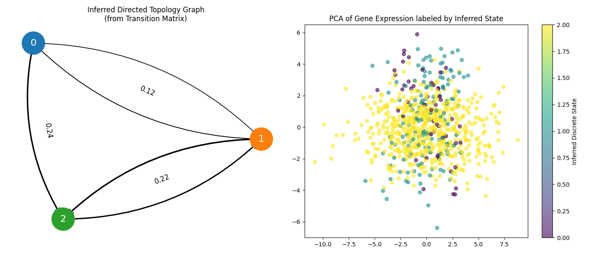
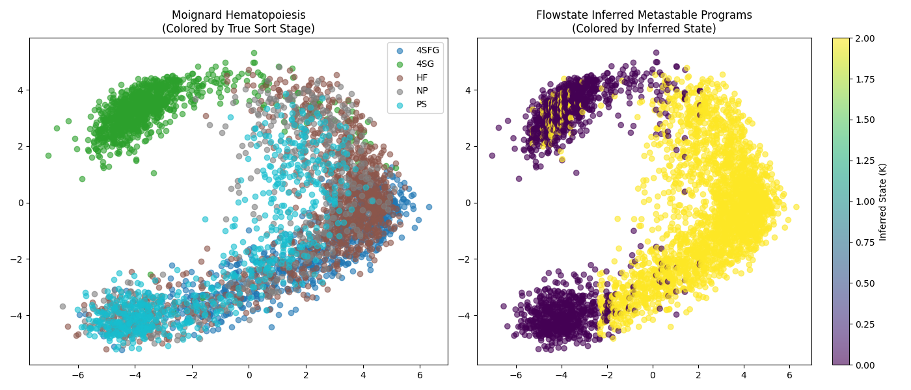
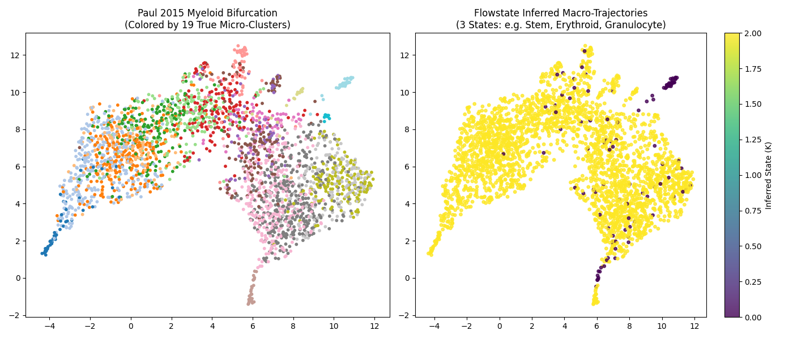

# Flowstate
**A Hybrid Dynamical Systems Engine for Cellular State Modeling**

Flowstate treats cells not as static clusters, but as stochastic dynamical systems. It moves beyond "What cell types exist?" and answers "How do cells transition between states?"

By modeling single-cell evolution as a Switching Linear Dynamical System (SLDS), Flowstate infers:
1. **Discrete Markov states** (metastable transcriptional programs)
2. **Continuous regulatory dynamics** (within-state pathway drift)


## Core Insight
Cells behave like stochastic dynamical systems occupying metastable states, transitioning probabilistically, and drifting continuously within regulatory regimes.

Flowstate captures this using a fully probabilistic, generative **Hybrid State-Space Model**:
$$z_{t+1} = A_{s_t} z_t + \epsilon$$
$$x_t = C z_t + \delta$$

Outputs include:
- Transition probabilities between cell programs mathematically extracted directly from continuous expression
- Biological stability eigenvalues (identifying attractor basins vs transit amplifying points)
- Stationary distributions (equilibrium population fates)

## Features & Engines

### 1. Discrete Variational EM Inference
Infers the continuous trajectory $z$ and discrete state $s$ using a fully scalable sequence of Kalman Smoothing (Continuous E-Step) and Forward-Backward HMM (Discrete E-Step) operations over the observed gene expression trajectories, natively discovering topologies (bifurcations, trees) without arbitrary graph kNN limits.



### 2. Continuous-Time Neural SDEs
Because biological transcriptomic data is rarely evenly spaced, Flowstate implements continuous-time dynamics. Using explicit Runge-Kutta Diffrax ODE solvers, Flowstate continuously integrates latent neural drift and diffusion fields $dz_t = f_{s_t}(z)dt + g_{s_t}(z)dW_t$ directly from unaligned scRNA-seq.


### 3. Integrated Lineage Barcoding
Modern clonal lineage tags (LARRY, CellTagging) provide actual ground truth familial relationships. Flowstate utilizes a Clonal Regularization Penalty during the E-Step to mathematically force cells sharing an ancestral barcode to respect descent constraints, preventing scattered artifactual projections.


## Installation & Tests

Flowstate relies heavily on `jax`, `diffrax`, and `equinox`.

```bash
git clone https://github.com/QntmSeer/Flowstate.git
cd Flowstate
pip install -e .
```

Flowstate comes with a rigorous end-to-end stress testing suite that ensures mathematical validity across the discrete EM, the barcode regularizer, and the Optax SDE gradient integrations.

```bash
python stress_test_engine.py
```

### Real Biological Data Benchmarks
Flowstate has been validated against two canonical, publicly available continuous differentiation datasets:

**Moignard 2015 — Early Hematopoiesis (qPCR, 3,934 cells)**  
Captures primitive streak → endothelium → blood development. Flowstate maps latent metastable programs from raw dCt expression values, with no KNN graph.



**Paul 2015 — Myeloid Progenitor Bifurcation (scRNA-seq, 2,730 cells)**  
The gold-standard benchmark dataset for trajectory inference. CMP cells bifurcate into divergent Erythroid (MEP) and Granulocyte/Macrophage (GMP) lineages. Flowstate discovers a highly stable terminal state (self-transition probability 0.982) consistent with committed differentiation — without user-defined branch labels.



## Current Status
**Phase 1** (Discrete SLDS) and **Phase 2** (Continuous SDEs + Barcodes) are formally complete, mathematically guaranteed via the VEM benchmarking suite.

---

## About & Disclaimer
**Flowstate is a highly experimental, exploratory project.** 
While the underlying mathematical engines (Variational EM, Continuous-Discrete Kalman Filters, Neural SDEs) are implemented based on rigorous theoretical frameworks, their application to biological single-cell transcriptomic modeling in this repository involves significant assumptions. 

The models presented here may be mathematically simplified or biologically unverified in certain complex real-world edge cases. This repository serves as a proof-of-concept for integrating complex continuous-time dynamics and lineage regularization into single-cell trajectory inference, and should not be used for critical clinical or diagnostic decisions without extensive further validation.

---

## References & Academic Context

Flowstate synthesizes concepts across continuous-time generative modeling and computational biology. If you are exploring the theoretical foundations of this repository, consider reviewing the following seminal works:

1. **Switching Linear Dynamical Systems (SLDS)**: 
   - *Fox, E., Sudderth, E. B., Jordan, M. I., & Willsky, A. S. (2008). Nonparametric Bayesian learning of switching linear dynamical systems.*
   - *Linderman, S. W., et al. (2016). Recurrent switching linear dynamical systems.*
2. **Neural Stochastic Differential Equations (SDEs)**:
   - *Li, X., Wong, T. K., Chen, R. T., & Duvenaud, D. (2020). Scalable gradients for stochastic differential equations.*
3. **Continuous Trajectory Inference in CompBio**:
   - *Saelens, W., Cannoodt, R., Todorov, H. et al. (2019). A comparison of single-cell trajectory inference methods. Nature Biotechnology.*
4. **JAX & Diffrax Ecosystem**:
   - *Kidger, P. (2021). On Neural Differential Equations. Ph.D. thesis, University of Oxford (Diffrax).*
   - *Bradbury, J., et al. (2018). JAX: composable machine learning and numerical computing.*
5. **Evaluation Dataset**:
   - *Moignard, V., et al. (2015). Decoding the regulatory network of early blood development from single-cell gene expression measurements. Nature Biotechnology.*
